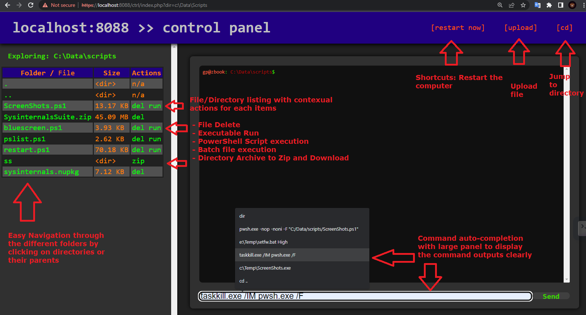
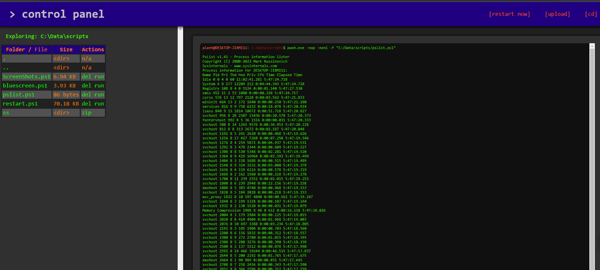

# A WebShell with personalized commands

A powerful and delightful PHP WebShell

This is a lightweight PHP webshell, using only vanilla JavaScript and CSS, no jQuery/Bootstrap bloat.

A webshell is a shell that you can access through the web. This is useful for when you have firewalls that filter outgoing traffic on ports other than port 80. As long as you have a webserver, and want it to function, you can't filter our traffic on port 80 (and 443). It is also a bit more stealthy than a reverse shell on other ports since the traffic is hidden in the http traffic.

This WebShell lets the user run powershell scripts, upload files, download files, browse in the directories, run executables, etc...

### Rome-Shell

This Web Shell was based from the [rome-webshell](https://github.com/Caesarovich/rome-webshell) code. I fixed bugs occuring on Windows 10 and added some functionalities I needed.

### Functionalities

1) run powershell scripts
2) upload files
3) download files
4) browse in the directories
5) run executables

### Panel

Here's some details on the Main Panel Interface



Here's a screen shot of a script executing...




### Obfuscation of the Code

See [the PhpObfuscate repo](https://github.com/arsscriptum/PowerShell.Public.Sandbox/tree/master/PhpObfuscate)

```
    cd .\scripts\
    . .\run_obfuscate.ps1

    [OBFUSCATION] Operation Completed. "... obfuscated\coded.php"
```

### Features to add in the future...
 
 ...